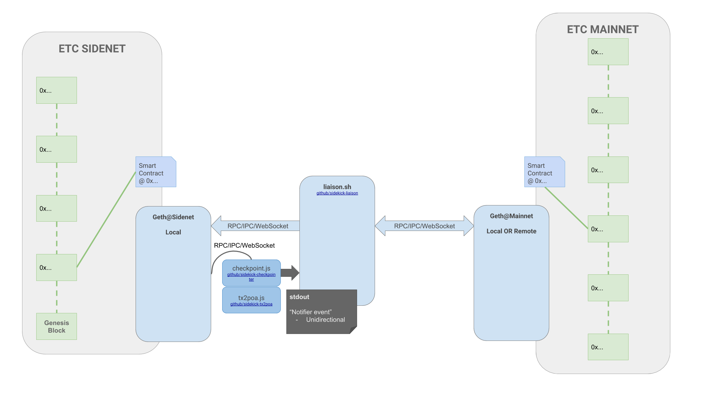

# Exploring MVP Sidechains on ETC

## Introducing sidechains

#### What even is a sidechain?

There are two critical pieces:

1. A sidechain is a blockchain network that works very similarly to `mainnet`... _but isn't_. For whatever reason the sidechain is an insulated network that probably uses the same or similar technology as the mainnet. It could, for example, be run by a company or companies who want to distribute a consensus-based ledger/application framework, but don't want to be beholden to the unwashed and agnostic democracy that govern the economics and politics of the `mainnet`.
2. A sidechain _talks to_ `mainnet`. This is what makes a sidechain a sidechain, instead of a plain old private network. By talking to the mainnet, the sidechain is able to balance the advantages a private network with the security of the mainnet.


#### So what are the advantages (or disadvantages) of a sidechain?

_Pros:_

1. Its cheaper. You don't have to pay market prices for gas.
2. You (or a select group) are in charge. If you want to hard fork you don't have to convice Vitalik... unless you are Vitalik.
3. You can use new or different technologies than mainnet. Want to use a different consensus method like Proof of Authority/Stake/Vita-like? Go for it. It's your chain.

_Cons:_

1. Security. Despite the smell, the unwashed democracy of the mainnet is exactly what makes it safe. A private chain is by definition not (as) distributed or diverse as a private network.

Addressing `Con#1` is where the whole networks-talking-to-each-other thing comes in. If it's too expensive/slow/annoying to use mainnet for every transaction... let's just use it for _some_ transactions. If the sidechain can once in a while tell mainnet: "Hey, here's an update about what our network looks like now," then it'll have a secure and permanent record of what the state of affairs _should look like_ on the sidechain at a given point. This is called a _checkpoint_ pattern.

#### Data flows

If the sidenet were _only to POST data_ to the mainnet, and never depend on querying that data again, there would indeed be a secure _record_ of the sidechain history... but there's nothing to ensure that the sidechain history -- the record itself -- would actually have integrity relative to the mainnet.

The mainnet's integrity is a function of necessitating sequential congruence; the value of block B depends on the value of block A, and everyone's got to agree (or at least not rebut) that the given pieces do actually fit together. Chain progression and integrity is derived from sequential consensus.

So without checking -- and relying on -- the checkpoint data stored on mainnet, the sidenet is missing out on the security of the consensus mechanisms of the mainnet. If it doesn't depend data from the mainnet, then it doesn't get any of the value of putting data on mainnet in the first place. I repeat myself. That part is important.

For further reference, let's call a pattern where sidenet does _POST only_ to mainnet a __unilateral__ communication mechanism, and the pattern with _POST and QUERY_ a __bilateral__ mechanism.


## Building a ~~dumbest possible~~ minimum-viable sidechain



#### Why minimum-viable?

- Because I'm kind of slow and want to mess around with the concepts before tangling too much with client/protocol consensus-facing code.
- Because changes to client code are more complex and have external dependencies. Code must be written, refactored, rewritten, reviewed, heckled, rebased, merged, tagged, and released. Documentation needs to be documented, clients updated, tests tested, bugs fixed... and so forth. Eventually the best solution(s) _will_ involve significant and diverse changes to the client(s), but for now we're still in the "what does this even mean" phase, and a minimum-viable proof-of-concept should approach being runnable by anybody _now_... if possible.
- And finally, because it's fun to see how we could bend already-existing stuff to make it do new weird stuff.

#### Conceptual requirements

There are a few key challenges in developing a sidechain-ready scenario.

__Consensus__. It's likely that on the side network it won't be desirable to use Proof of Work (at least for the immediate use-cases -- it doesn't take too far of a visionary leap to imagine a range of reasons and contexts accomodating the gamut of consensus patterns). First use-cases are insulated, federated, and are eager to gain the benefits that come without reverence to fully distributed consensus. A likely and probably first-use case is Proof of Authority, so we'll tend that direction in this experiment.

__Chain-to-chain communication__. For sidechains, this will mean establishing the mechanism that is able to inform block validation relative to the state of the mainnet. As a client/protocol implementation this will likely mean changes or additions to RLPx protocol, p2p patterns, and the refactoring of clients towards simultaneous multi-chain support. Our implementation will outsource this responsibility to a "sidecar" application.

__Checkpoints__. Tying together points `1` and `2`, implementing checkpoints will be in large part a function of how we decide to roll consensus and communication between chains. The interesting part will be building the logistics a system that can be used to efficiently "fingerprint" a state of affairs on the sidenet, store that data in the mainnet, and then use a query from mainnet for that data to validate the integrity of the sidenet later on. There will be hashes.

> Aside: IMO it's really dumb that they're called smart contracts. They're not smart and they're not really contracts. They're just programs.

#### Things we'll (sort of) build

1. A Proof of Authority mechanism to solve the `Consensus` requirement.
2. A mechanism to enable chain-to-chain communication.
3. A mechanism to create and validate checkpoints on the sidechain.
4. Smart contracts for mainnet and sidenet to store and delegate checkpoint fingerprints and fingerprint validation.

> TODO: Write these smart contracts. The PoC is far stronger with viable contracts to make data handling exemplary and explicit.

Please note that in some aspects these projects are interdependent. For example, the checkpoint mechanism will be interdependent with the consensus mechanism, since both require and facilitate block validation. And chain-to-chain communication will be dependent on the the timing and logistics of the checkpointing scheme, so those will need to integrate smoothly as well.

The chain-to-chain "liaison" is the least natively-accessible challenge for pre-existing clients, and to address it we'll write a tiny third-party "sidecar" application that will live next door to the client.

The reason we're "sort of" building these things is because I'm not that interested in developing code barely beyond pseudo-code. That's why they call it _minimum_ viable.

Please see [Appendix #technical requirements](#technical-requirements) for more specifics.


### Getting started

#### Geth's JS Console

As a primary tool for messing with the [go-ethereum client (aka Geth)](https://github.com/ethereumproject/go-ethereum)'s consensus mechanism and checkpointing, I'm going to use the built-in Javascript Console tools. These tools are closely related with the JSON-RPC API, and allow interactive and/or programmatic interfacing with a running client via WS, RPC, or IPC.

Geth has three subcommands built around the JS console: `console`, `attach`, and `js`.

1. `$ geth console` starts geth and begins an _interactive_ JS console session.
2. `$ geth attach` connects to an _already-running_ geth client and then begins an interactive session.
3. `$ geth js program.js` begins an _ephemeral_ JS session, running a given `program.js` _without interactivity_.


Geth's display and debug logs use stderr exclusively, while console.log from geth's JS Console goes to stdout. This allows to use geth's attach, console, or ephemeral js subcommands as dedicated data stream writers.

There's a lot of options and different ways to use these three subcommands, but, while tempting, a deep dive in that direction is out of scope here. I hope the brief associated commentary in the following examples are sufficient for the purpose at hand.

I'll use the console to run arbitrary javascript scripts that implement adhoc PoA and checkpoint features.


> https://github.com/ethereumproject/go-ethereum/wiki/JavaScript-Console


#### A ~~hacky bash script~~ "sidecar" application


One of the most significant limitations of geth's console and it's primary facilitator `web3.js` is the notable absense of web-based calls. The libraries don't include standard web protocol tools akin to `AJAX` or `curl`. This is because the web is a murky, untrustworthy place, filled with fake news and flip facebook friends, and the thought is that it's kind of antithetical to the design intentions for the fundamentals of a blockchain.

> There are a few approaches to solutions around this limitation, like "oracles" and even a few distributed protocols that hope to integrate the two worlds in a trustable/trustless way, and in the future might be an interesting avenue of further exploration as far as chain integrations initiated from within the content of the blockchain.

Web3 aside, current clients are designed to initialize their configuration and behavior around a single `network_id` value to differentiate and identify nodes participating in a matching chain. Support for a range of chains is on the horizon, but not yet actualized, meaning that client p2p protocols can't be readily used to communicate between chains.

So for the time being we're going to use a simple external script `liaison.sh` to handle the inter-chain communication responsibility.

The `liaison.sh` program has three primary event-based behaviors to implement:

1. On a sidenet checkpoint-creation event, POST data delegated from a sidechain node to a mainnet endpoint. For this example, this will mean __POSTing a transaction__ containing a fingerprint hash of a sidechain block(s) or state to a contract address on the mainnet.
2. IFF the _success_ of `1`, POST a transaction to a corresponding smart contract on the sidechain providing validation of the successful integration.
3. IFF the _failure_ of `1`, do not provide the validation. This could be accomplished either with a transaction to the sidechain providing a negative status and associated error data around the failure of `2`, or, more simply, by the notable absence of the proof-positive expected from `2`.

__NOTE__ that the `liaison.sh` application bears _a lot_ of responsibility. It's a lynch-pin, and we're going to have as much trust in the functionality of this program and its environment as we do in the reliability of the client.


### The code

We're going to go on an adventure.

I've put together a few repositories on Github that hold pseudo/code that are important touchstones for this document. I recommend opening a neighboring tab or two.

- [github.com/ETCDEVTeam/sidekick-tx2poa](http://github.com/ETCDEVTeam/sidekick-tx2poa). A PoA mechanism implemented through an emphemeral JS console.
  + [github.com/ETCDEVTeam/sidekick-poc](github.com/ETCDEVTeam/sidekick-poc). A working proof-of-concept configuration for a private network using Tx2PoA.

- [github.com/ETCDEVTeam/sidekick-liaison](http://github.com/ETCDEVTeam/sidekick-liaison). A bash script that listens to a sidechain node and facilitates communication with an arbitrary mainnet node. As written, relies on [emerald-cli](https://github.com/ETCDEVTeam/emerald-cli).

- [github.com/ETCDEVTeam/sidekick-checkpointer](http://github.com/ETCDEVTeam/sidekick-checkpointer). A checkpointing mechanism implemented through an ephemeral JS console.

- [ ] Examples of mainnet and sidenet smart contracts to manage inter-chain state verification.

Since each of these repositories have their own associated documentation (as far as READMEs and fairly extensive code comments), I'm going here only to touch on some demonstrative highlights.

#### PoA consensus in adhoc javascript

The core idea of [ETCDEVTeam/tx2poa](https://github.com/ETCDEVTeam/sidekick-tx2poa) is for designated "Authority" nodes to use "incomplete proof of authority transactions" to assert their _authorship_ of the blocks they mine by broadcasting their participation in the round along with a piece of a signed hash that together with data provided in a candidate winning next block can be used by any node to verify that the candidate winning block must have actually been mined by the authority miner. 

For practicality, the proposed spec relies on a mock `ethash-test` PoW consensus scheme, which basically means that it's super easy to mine new blocks. Although this is far faster and cheaper than running the PoA alongside the real `ethash` PoW, the PoA scheme is PoW-implementation agnostic.

There is a working configuration using this script for a PoA private network at [github.com/ETCDEVTeam/sidekick-poc](github.com/ETCDEVTeam/sidekick-poc).

Please read through the repo's README and code comments for more implementation details. 


#### Checkpointing and liaison-ing

In practice using the checkpointing and liaison mechanisms together might look something like this:

`$ geth --chain sidenet --js-path="sidekick" js `[checkpointer.js](https://github.com/ETCDEVTeam/sidekick-checkpointer/blob/master/checkpoint.js)` | `[liaison.sh](http://github.com/ETCDEVTeam/sidekick-liaison/blob/master/liaison.sh)

Here we're using geth's emphemeral JS console to run the `checkpoint.js` script, and then pipe `stdout` along to our liaison script. Since the pipe is only forwarding `stdout` we're still able to view and redirect geth's normal `stderr` logs.

`checkpoint.js` relies on two constants: an interval integer at which to process checkpoints, and a smart contract to query for arbitrary verification data.

In this example, upon confirming the security of the most recent past checkpoint, a new checkpoint is allowed to be posited for archiving on the mainnet. If the confirmation of the past checkpoint fails, however, the client is instructed to roll the chain back to the last known valid checkpoint, which is the "grandparent" of the current checkpoint candidate.

```js
function assertCheckpoint(blockNumber) {
  var block = eth.getBlock(blockNum);

  // var json = {"block": blockNum, "hash": block.hash};
  // var jsonstring = JSON.stringify(json);

  // for demo purposes just write block hash to console log, which goes to stdout.
  // this can then be captured by the "sidecar" liaison application
  console.log(block.hash);
}

// checkpointHandler abstract handling checkpoint event management.
// it accepts functions for checkpoint success and failure callbacks, each which are passed
// the current checkpoint blocknumber.
function checkpointHandler(onSuccess, onFail) {
  var blockNum = eth.blockNumber;
  var distanceFromCheckpoint = blockNum % checkpointInterval;

  // if the chain has arrived at a checkpoint block
  if (blockNum !== 0 && distanceFromCheckpoint === 0) {

      // if contract fails (data from mainnet was invalid), purge blocks between current block (which would have been newest checkpoint) and last checkpoint
      if (!validateCheckpoint(blockNum)) {

        // fire failure callback
        if (onFail !== null) {
          onFail(blockNum);
        }

      // else our contract was updated and valid, verifying that our last checkpoint was successfully recorded on the mainnet
      } else {

          // fire success callback
          if (onSuccess !== null) {
            onSuccess(blockNum);
          }

          // now we can wait the precise amount of blocks until the next scheduled checkpoint
          admin.sleepBlocks(checkpointInterval);
      }
  } else {
      // otherwise the chain head is not at a checkpoint... wait until next checkpoint.
      // this will only be called once immediately after client start up
      admin.sleepBlocks(distanceFromCheckpoint);
  }
  checkpointHandler();
}

checkpointHandler(assertCheckpoint, function onError(blockNumber) {
  debug.setHead(blockNumber - 2*checkpointInterval);
});
```

Via the tiny `console.log` statement we're able to send arbitrary data directly to a waiting `liaison.sh`
script.

`liaison.sh`, using a simple `while read` loop, can then be "notified" of arbitrarily complex events coming from geth's latest checkpoint and act accordingly. As written, the code only handles an incoming block hash for simplicity of demonstration, for example:

```shell
while read -r line; do
	echo "Sidecar application received notification of checkpoint event. Data: $line"
	sidenet_checkpoint_block_hash="$line" # just for example. obviously could be a lot more sophisticated
	# 1. Send an upstream transaction to store data on mainnet.
	#
	EMERALD_GAS_COST=21 \
	txHash=$(emerald transaction send \
		# our sidekick's account
	    0x0e7c045110b8dbf29765047380898919c5cb56f4 \
	    # our mainnet contract address
	    "$upstream_contract_address" \
	    0x1 \
	    --data="$sidenet_checkpoint_block_hash"
	    --gas=0x2100 \
	    --upstream="$upstream" \
	    < echo "secret passphrase")

```

Using `curl` and an assumed [emerald-cli](https://github.com/ETCDEVTeam/emerald-cli), the script facilitates posting transactions to designated smart contract address on both the mainnet and reciprocally to the sidechain.

The important thing is that the script not only acts on an event coming from the sidenet client, but also that it's able to listen or monitor for a corresponding "status update" from mainnet. This is implemented here, albeit awkwardly, as

```shell
while [ $rpc_call_attempts -lt 10 ]; do
  res=$(curl -X POST --data '{"jsonrpc":"2.0","method":"eth_getTransactionByHash","params":["'$txHash'"],"id":1}' "$upstream")
  # If Tx has or has not been incuded in a block.
  # Include other validation here, like does the result of eth_call(tx.code) == expected? eg. check that not only was tx included, but data is also properly stored in contract.
  # Again, this is pseudo code.
  if [[ $(echo "$res" | /usr/bin/local/json result.blockHash) =~ "0x0000"* ]]; then
    rpc_call_attempts=$(( rpc_call_attempts + 1 ))
    sleep 10
  else
    sidekick_exitcode=0
    break; # break while loop. we're done here
  fi
done
```

In this case, the liaison has until the sidechain's next checkpoint block to confirm that the transaction on mainnet was successful, and then to post a "receipt" transaction of this to sidenet. 

#### Smart contracts

One important facet of this schema that I haven't gone into (yet?) are the smart contracts. Here's what they'll need to do.

On mainnet:

- Accept data `d` from a transaction created only by a whitelisted address.
- Store data `d` and return, say, `sha3(d1,d2)`. We want the return value to be confirmable (reproducible) outside of the contract, and for the return value to be useful for establishing verified current and past checkpoints.
- Limit the amount is `d`s that can be stored.

On sidenet:

- Pretty much the same as on mainnet.

## Notes and limitations

- Most of this code is pseudo code at this point.

## Appendix

### Technical requirements

#### Generic consensus mechanism
- Any node `n` must be able to determine the validity of any given block `b`.
- Every node `n` must validate each block `b` independently.
- In case of an invalid block `b'`, it must not be added `n`'s canonical chain.

#### Liaison mechanism

#### Checkpoint mechanism

#### Smart contract checkpoint storage
